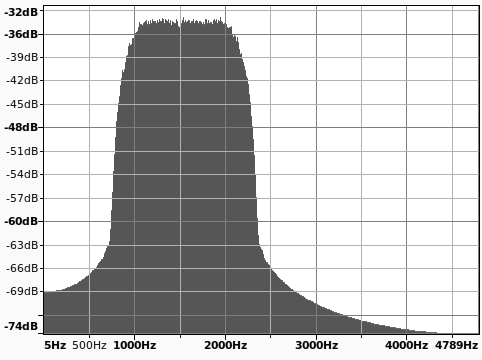
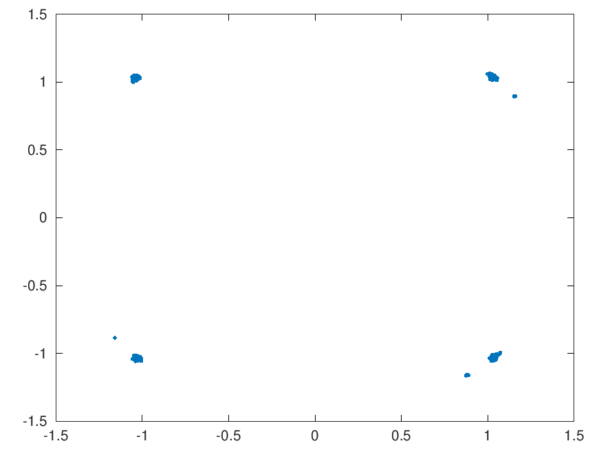

#### QPSK - An Experimental QPSK Modem
This project is to design a 9600 bit/s QPSK 2400 Baud modem that does not require a preamble, or a Unique Word (UW) in order to synchronize the timing. There may be a sync word as part of a protocol, but not for timing.

In theory, we don't know where the QPSK time-domain symbols begin. So we average the amplitudes over a cycle. Then we generate seven (7) histograms based on the sample point. The histogram with the highest count is the winner. At this point we declare the proper index to add during demodulation (after decimation) at the modem signal rate (2400 Baud).

There also needs to be a frequency error adjustment. Not so much for fixed radio sites (VHF/UHF), as they don't move, but when mobile, of course, will have a Doppler shift to be corrected. Solutions via ```pull request``` considered.

The testing program uses Octave to generate the scatter plot. This is not really needed, but used to check progress.

Here's the transmit spectrum as viewed in audacity:

  

The receive costas loop is not fully debugged, but looks reasonable so far...

  
