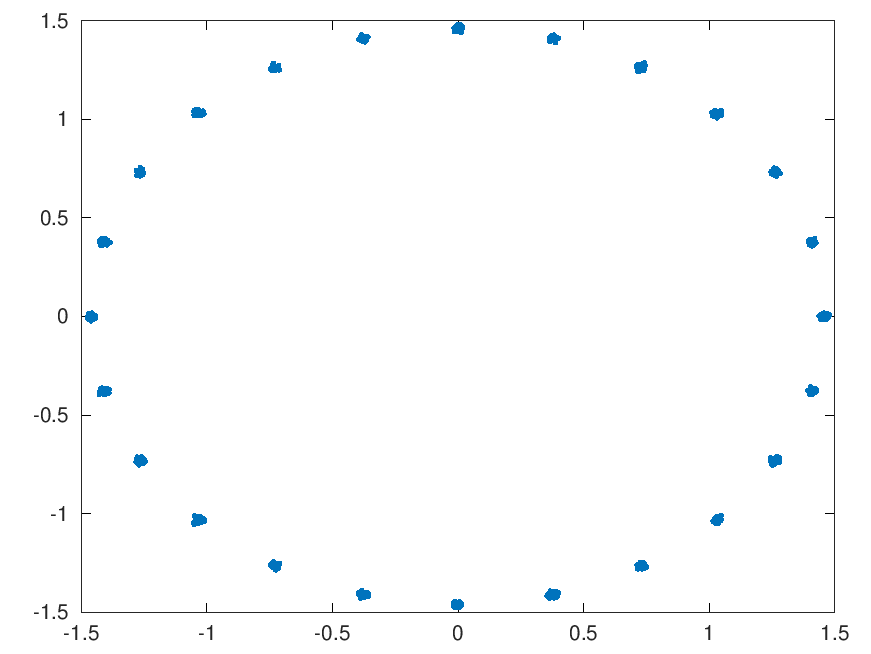

#### QPSK - An Experimental QPSK Packet Data Modem
This project is to design a modem which does not require a preamble, or a Unique Word (UW) in order to synchronize the timing. There may be a sync word as part of a protocol, but not for timing. I'm interested in making it work for QPSK 2400 Baud VHF/UHF band. This is an alternative to FM modems.

In theory, we don't know where the QPSK time-domain symbols begin. So we average the sample rate amplitudes over a symbol cycle. Then we generate seven (7) histograms based on these sample points. The histogram with the highest count is the winner. At this point we declare the proper index to add during demodulation (after decimation) at the symbol rate (2400 Baud).

There also needs to be a frequency error adjustment. Not so much for fixed radio sites, as they don't move, but when mobile, of course, will have a varying Doppler shift to be corrected. I ported the GNU Radio Costas loop C++ code to C and merged that with the receiver code. I also made the costas loop optional, so you can turn it off. This might be acceptable for fixed radio sites.

To compile and make the ```qpsk``` binary, just type ```make``` or if you want to see the scatter diagram graphic ```make test_scatter```

Here's the 2400 Baud transmit spectrum (random bits) with 9600 sample rate as viewed in audacity:

  

This display is with a 50 Hz frequency error and costas loop enabled:

  

This display is with a 50 Hz frequency error and costas loop disabled:  

   
